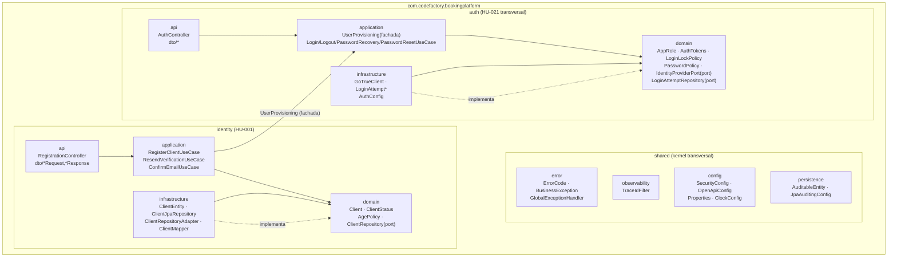

# Diagrama de paquetes y componentes — Sprint 1

## Estilo arquitectónico preliminar

**Monolito modular con arquitectura limpia por módulo** (ver ADR-0001).

- Un único artefacto desplegable (`bookingplatform-0.0.1-SNAPSHOT.jar`).
- Módulos por dominio de negocio (`identity`, futuro `catalog`, `booking`) + módulo
  transversal (`auth`) + kernel compartido (`shared`).
- Dentro de cada módulo, capas con **regla de dependencia hacia adentro**:
  `api → application → domain ← infrastructure`.
- El dominio es 100% puro (POJOs, sin Spring/JPA/Jackson). La persistencia y los
  proveedores externos son adaptadores que implementan *ports* del dominio.
- La comunicación entre módulos solo usa la fachada `application` o el modelo
  `domain` del otro módulo — nunca su `infrastructure` ni su `api`.
- Todas las reglas se verifican automáticamente con ArchUnit (`ArchitectureTest`).

## Diagrama de paquetes

## Componentes e interfaces (Sprint 1)

| Componente | Capa | Interfaz expuesta | Consumidores |
|---|---|---|---|
| `RegistrationController` | identity/api | `POST /api/v1/registrations`, `POST /api/v1/registrations/verification-resends`, `POST /api/v1/registrations/email-verifications` | Clientes HTTP (públicos) |
| `RegisterClientUseCase` | identity/application | `register(RegisterClientCommand): RegistrationOutcome` | RegistrationController |
| `ResendVerificationUseCase` | identity/application | `resend(email)` | RegistrationController |
| `ConfirmEmailUseCase` | identity/application | `confirm(tokenHash): RegistrationOutcome` | RegistrationController |
| `ClientRepository` (port) | identity/domain | `findById/findByEmail/existsByEmail/existsByDocument/save` | Casos de uso identity |
| `ClientRepositoryAdapter` | identity/infrastructure | implementa `ClientRepository` con JPA + MapStruct | Spring (wiring) |
| `AuthController` | auth/api | `POST /api/v1/auth/login`, `POST /logout`, `POST /password-recovery-requests`, `POST /password-resets`, `GET /me` | Clientes HTTP (login público; logout/me autenticados) |
| `UserProvisioning` (fachada pública del módulo) | auth/application | `provisionClientUser(email,password): UUID`, `deprovisionUser(id)`, `resendSignupVerification(email)`, `confirmEmail(tokenHash): ConfirmedUser` | identity/application |
| `LoginUseCase` | auth/application | `login(email,password): AuthTokens` | AuthController |
| `IdentityProviderPort` (port) | auth/domain | `createUser/deleteUser/requestPasswordToken/verifyEmailToken/resendSignupVerification/sendPasswordRecovery/resetPasswordWithToken/signOut` | Casos de uso auth |
| `GoTrueClient` | auth/infrastructure | implementa `IdentityProviderPort` contra Supabase Auth (RestClient, secret key server-side) | Spring (wiring) |
| `LoginAttemptRepository` (port) | auth/domain | `recordAttempt`, `findFailuresSince` | LoginUseCase |
| `GlobalExceptionHandler` | shared/error | contrato `application/problem+json` (`errorCode`, `traceId`, `details`) | Todos los módulos |
| `TraceIdFilter` | shared/observability | header `X-Trace-Id` + MDC `traceId` en logs | Todas las peticiones |
| `SecurityConfig` + `SupabaseJwtAuthConverter` | shared/config | validación JWT por JWKS (ES256/RS256) y mapeo `app_metadata.role → ROLE_*` | Resource server |

## Módulos previstos (no implementados en Sprint 1)

`catalog` (HU-002 proveedor/sedes/reglas, HU-004 servicios/recursos) y
`booking` (reservas, disponibilidad, cancelaciones, reportes). Nacerán con la
misma estructura interna; las interfaces entre módulos seguirán siendo fachadas
`application` (y eventos de dominio si se requieren en el futuro, ver ADR-0001).

## Reglas de dependencia (verificadas por ArchUnit)

1. `..domain..` no depende de Spring, JPA, Jackson ni Swagger.
2. `..application..` no depende de `..api..` ni `..infrastructure..`.
3. `..infrastructure..` no depende de `..api..`.
4. `identity` no depende de `auth.api` ni `auth.infrastructure`.
5. `auth` no depende de `identity` (transversal independiente del negocio).
6. `shared` no depende de ningún módulo de negocio.
7. `*Controller` solo en `..api..`; `*UseCase` solo en `..application..`; `*Entity` solo en `..infrastructure..`.
