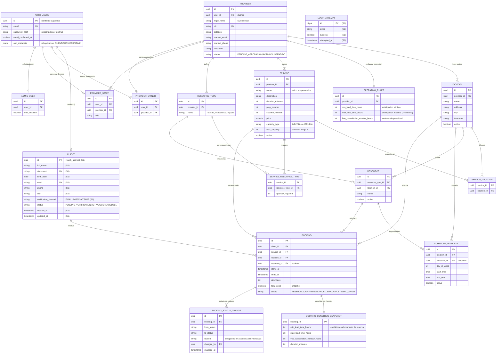

# Modelo lógico — Plataforma de Reservas de Servicios

Modelo entidad-relación del dominio completo del caso. Las tablas marcadas con
**(S1)** pertenecen al modelo físico inicial del Sprint 1; el resto se implementará
en sprints posteriores conforme a las HU-002/003/004 y de reservas.

Las credenciales (email, password, confirmación de correo) viven en `auth.users`
de Supabase; el backend guarda únicamente perfiles y datos de negocio enlazados
por `user_id` (UUID).

## Decisiones de modelado

| Decisión | Justificación |
|---|---|
| `clients.id` = `auth.users.id` (UUID) | Un solo identificador para identidad y perfil; sin tabla `users` propia que duplicaría credenciales. |
| Perfil de proveedor separado de `auth.users` | El negocio (NIT, sedes, reglas) es de la empresa; la cuenta es de la persona dueña/encargada. |
| `booking_condition_snapshot` | Regla HU-002/HU-004: los cambios de parámetros o duración aplican solo a nuevas reservas; las vigentes conservan sus condiciones. |
| `booking_status_change.reason` | HU-003: aprobar/suspender/reactivar exigen motivo y traza de auditoría. |
| `login_attempts` en BD propia | GoTrue solo aplica rate limiting por IP; el bloqueo por cuenta (HU-021) es regla de negocio local. |
| Estados como `varchar` + enums en código | Legibilidad en consultas/reportes; Spring mapea enums `EnumType.STRING`. |

Ver `schema.sql` (modelo físico inicial Sprint 1), `rls.sql` (seguridad Supabase)
y `consultas-clave.md` (preguntas de negocio y su SQL).
