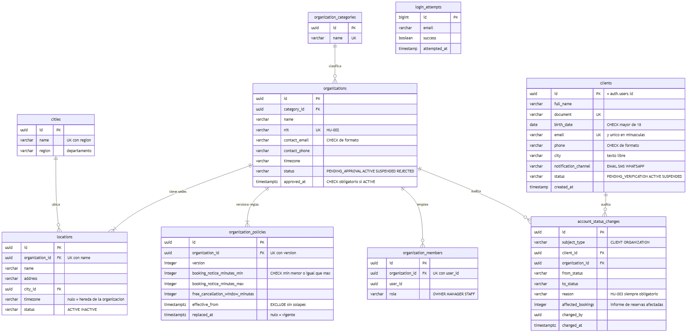
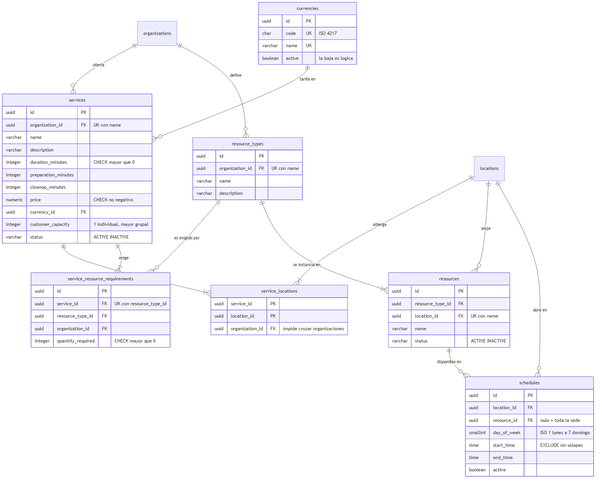
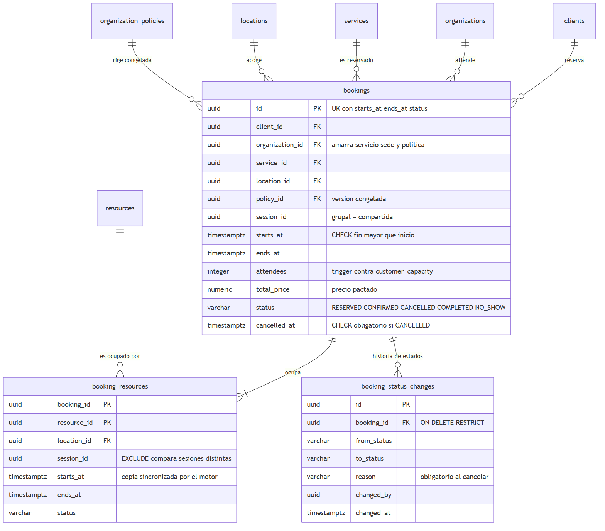

# Modelo lógico — Plataforma de Reservas de Servicios

Modelo entidad-relación del dominio completo del caso. Las diecinueve entidades
existen en `schema.sql`; las marcadas con **(S1)** además tienen entidad JPA y
están en producción, el resto es modelo de datos adelantado al código.

Las credenciales (correo, contraseña, confirmación) viven en `auth.users` de
Supabase, que el script no crea. Por eso `CLIENT.id`,
`ORGANIZATION_MEMBER.user_id` y `ACCOUNT_STATUS_CHANGE.changed_by` no tienen
clave foránea declarada: su destino está en otro esquema.

```mermaid
erDiagram
    CITY ||--o{ LOCATION : "ubica"
    ORGANIZATION_CATEGORY ||--o{ ORGANIZATION : "clasifica"
    ORGANIZATION ||--|{ LOCATION : "tiene sedes"
    ORGANIZATION ||--|{ ORGANIZATION_POLICY : "versiona reglas"
    ORGANIZATION ||--o{ ORGANIZATION_MEMBER : "emplea"
    ORGANIZATION ||--o{ SERVICE : "oferta"
    ORGANIZATION ||--o{ RESOURCE_TYPE : "define"
    ORGANIZATION ||--o{ ACCOUNT_STATUS_CHANGE : "audita"
    CLIENT ||--o{ ACCOUNT_STATUS_CHANGE : "audita"
    CURRENCY ||--o{ SERVICE : "tarifa en"
    SERVICE ||--|{ SERVICE_LOCATION : "se presta en"
    LOCATION ||--|{ SERVICE_LOCATION : "alberga"
    SERVICE ||--|{ SERVICE_RESOURCE_REQUIREMENT : "exige"
    RESOURCE_TYPE ||--o{ SERVICE_RESOURCE_REQUIREMENT : "es exigido por"
    RESOURCE_TYPE ||--|{ RESOURCE : "se instancia en"
    LOCATION ||--o{ RESOURCE : "aloja"
    LOCATION ||--o{ SCHEDULE : "abre en"
    RESOURCE ||--o{ SCHEDULE : "disponible en"
    CLIENT ||--o{ BOOKING : "reserva"
    ORGANIZATION ||--o{ BOOKING : "atiende"
    SERVICE ||--o{ BOOKING : "es reservado"
    LOCATION ||--o{ BOOKING : "acoge"
    ORGANIZATION_POLICY ||--o{ BOOKING : "rige congelada"
    BOOKING ||--|{ BOOKING_RESOURCE : "ocupa"
    RESOURCE ||--o{ BOOKING_RESOURCE : "es ocupado por"
    BOOKING ||--o{ BOOKING_STATUS_CHANGE : "historia de estados"

    CITY {
        uuid id PK
        string name "UK con region"
        string region "departamento"
    }
    CLIENT {
        uuid id PK "= auth.users.id (S1)"
        string full_name "(S1)"
        string document UK "(S1)"
        date birth_date "CHECK mayor de 18 (S1)"
        string email UK "unico tambien en minusculas (S1)"
        string phone "CHECK de formato (S1)"
        string city "texto libre (S1)"
        string notification_channel "EMAIL SMS WHATSAPP (S1)"
        string status "PENDING_VERIFICATION ACTIVE SUSPENDED (S1)"
        timestamp created_at "(S1)"
        timestamp updated_at "(S1)"
    }
    LOGIN_ATTEMPT {
        bigint id PK "(S1)"
        string email "se enlaza por correo, no por FK (S1)"
        boolean success "(S1)"
        timestamp attempted_at "(S1)"
    }
    ORGANIZATION_CATEGORY {
        uuid id PK
        string name UK
    }
    ORGANIZATION {
        uuid id PK
        uuid category_id FK
        string name
        string nit UK "HU-002"
        string contact_email "CHECK de formato"
        string contact_phone
        string timezone
        string status "PENDING_APPROVAL ACTIVE SUSPENDED REJECTED"
        timestamptz approved_at "CHECK obligatorio si ACTIVE"
    }
    ORGANIZATION_MEMBER {
        uuid id PK
        uuid organization_id FK "UK con user_id"
        uuid user_id "= auth.users.id"
        string role "OWNER MANAGER STAFF"
    }
    ORGANIZATION_POLICY {
        uuid id PK
        uuid organization_id FK "UK con version"
        int version
        int booking_notice_minutes_min "CHECK min menor o igual que max"
        int booking_notice_minutes_max
        int free_cancellation_window_minutes
        timestamptz effective_from "EXCLUDE sin solapes"
        timestamptz replaced_at "nulo = vigente"
    }
    LOCATION {
        uuid id PK
        uuid organization_id FK "UK con name"
        string name
        string address
        uuid city_id FK
        string timezone "nulo = hereda de la organizacion"
        string status "ACTIVE INACTIVE"
    }
    ACCOUNT_STATUS_CHANGE {
        uuid id PK
        string subject_type "CLIENT ORGANIZATION"
        uuid client_id FK
        uuid organization_id FK
        string from_status
        string to_status
        string reason "HU-003 siempre obligatorio"
        int affected_bookings "informe de reservas afectadas"
        uuid changed_by
        timestamptz changed_at
    }
    CURRENCY {
        uuid id PK
        string code UK "ISO 4217"
        string name UK
        boolean active "la baja es logica"
    }
    SERVICE {
        uuid id PK
        uuid organization_id FK "UK con name"
        string name
        string description
        int duration_minutes
        int preparation_minutes
        int cleanup_minutes
        numeric price
        uuid currency_id FK
        int customer_capacity "1 individual, mayor grupal"
        string status "ACTIVE INACTIVE"
    }
    SERVICE_LOCATION {
        uuid service_id PK
        uuid location_id PK
        uuid organization_id FK "impide cruzar organizaciones"
    }
    RESOURCE_TYPE {
        uuid id PK
        uuid organization_id FK "UK con name"
        string name
        string description
    }
    SERVICE_RESOURCE_REQUIREMENT {
        uuid id PK
        uuid service_id FK "UK con resource_type_id"
        uuid resource_type_id FK
        uuid organization_id FK
        int quantity_required
    }
    RESOURCE {
        uuid id PK
        uuid resource_type_id FK
        uuid location_id FK "UK con name"
        string name
        string status "ACTIVE INACTIVE"
    }
    SCHEDULE {
        uuid id PK
        uuid location_id FK
        uuid resource_id FK "nulo = toda la sede"
        smallint day_of_week "ISO 1 lunes a 7 domingo"
        time start_time "EXCLUDE sin solapes"
        time end_time
        boolean active
    }
    BOOKING {
        uuid id PK "UK con starts_at ends_at status"
        uuid client_id FK
        uuid organization_id FK "amarra servicio sede y politica"
        uuid service_id FK
        uuid location_id FK
        uuid policy_id FK "version congelada HU-002"
        uuid session_id "grupal = compartida"
        timestamptz starts_at
        timestamptz ends_at
        int attendees "trigger contra customer_capacity"
        numeric total_price "precio pactado"
        string status "RESERVED CONFIRMED CANCELLED COMPLETED NO_SHOW"
        timestamptz cancelled_at
    }
    BOOKING_RESOURCE {
        uuid booking_id PK "FK compuesta mantiene la copia"
        uuid resource_id PK
        uuid location_id FK
        uuid session_id "EXCLUDE compara sesiones distintas"
        timestamptz starts_at "copia sincronizada por el motor"
        timestamptz ends_at
        string status
    }
    BOOKING_STATUS_CHANGE {
        uuid id PK
        uuid booking_id FK "ON DELETE RESTRICT"
        string from_status
        string to_status
        string reason "obligatorio al cancelar"
        uuid changed_by
        timestamptz changed_at
    }
```

Si el diagrama no carga, las mismas relaciones están exportadas como imagen:

## Decisiones de modelado

| Decisión | Justificación |
|---|---|
| `CLIENT.id` = `auth.users.id` | Un solo identificador para identidad y perfil, sin duplicar credenciales (ADR-0002). |
| `CITY`, `ORGANIZATION_CATEGORY` y `CURRENCY` como catálogos | Eliminan dependencias transitivas y dejan el modelo en 3FN. |
| `ORGANIZATION_POLICY` versionada | HU-002 pide que los cambios de parámetros apliquen solo a reservas nuevas. Cada reserva apunta a la versión que regía al crearse, en vez de copiar los parámetros. |
| `SERVICE_LOCATION` con `organization_id` | Permite claves foráneas compuestas que impiden publicar un servicio de una organización en la sede de otra. |
| `BOOKING.organization_id` | Misma razón: amarra servicio, sede y política a la misma organización con tres claves foráneas compuestas. |
| `BOOKING.session_id` | Distingue la sesión de la reserva. En un servicio individual coinciden; en uno grupal varias reservas comparten sesión y por tanto comparten recurso sin chocar con la restricción de solape. |
| `BOOKING.total_price` | Precio pactado, no copia de `SERVICE.price`. Como el precio de catálogo cambia, la dependencia funcional no se cumple y no hay desnormalización. |
| `BOOKING_RESOURCE` repite el rango y el estado | Violación deliberada de 2FN: PostgreSQL no evalúa `exclude` a través de un join. La copia la mantiene el motor con una clave foránea compuesta contra la clave alterna de `BOOKING`, con `on update cascade`. |
| `BOOKING_STATUS_CHANGE` con `on delete restrict` | Un historial que desaparece junto con lo que traza no sirve de traza. |
| `ACCOUNT_STATUS_CHANGE` | HU-003 exige motivo al aprobar, suspender o reactivar, e informe de reservas afectadas. Esa regla es sobre cuentas, no sobre reservas. |
| `LOGIN_ATTEMPT` sin relación | Registra intentos con correos que pueden no corresponder a ninguna cuenta, que es justamente lo que interesa vigilar (HU-021). |
| Estados como `varchar` con `check` | Se leen directo en las consultas y añadir un valor no obliga a alterar un tipo. |

## Normalización

Las diecinueve relaciones están en 3FN. Quince alcanzan BCNF; tres se quedan en
3FN porque conservan clave primaria sustituta junto a una clave natural
declarada como `unique` (`ORGANIZATION_MEMBER`, `SERVICE_RESOURCE_REQUIREMENT`,
`SCHEDULE`), lo que preserva la dependencia sin que el determinante sea la clave
primaria. La excepción real es `BOOKING_RESOURCE`, cuya violación de 2FN está
justificada arriba y garantizada por el motor.

Tres puntos que sostienen esa afirmación:

- **Sin dependencias transitivas.** Ciudad, categoría y moneda salieron a
  catálogos. La excepción es `CLIENT.city`, que sigue siendo texto libre porque
  la tabla está implementada y cambiarla exige tocar el mapeo JPA; como no se
  guarda el departamento, tampoco arrastra la dependencia `city -> region`.
- **Cada dependencia funcional tiene su restricción.** Una dependencia que el
  diseño supone pero el esquema no garantiza no existe. Por eso hay veintiuna
  restricciones `unique` además de las claves primarias, incluidas las claves
  alternas `(id, organization_id)` que hacen posibles las foráneas compuestas.
- **Claves primarias naturales en las relaciones de intersección.**
  `SERVICE_LOCATION` y `BOOKING_RESOURCE` usan la combinación de sus foráneas.
  `ORGANIZATION_MEMBER` y `SERVICE_RESOURCE_REQUIREMENT` conservan clave
  sustituta con la natural declarada como `unique`, que preserva igual la
  dependencia.

## Lo que el esquema no garantiza

Estas reglas no se pueden expresar de forma declarativa y viven en la
aplicación. Se listan para que no se den por cubiertas:

- Que una reserva ocupe efectivamente los recursos que su servicio exige.
- Que una organización activa tenga al menos una sede (HU-002) y que un
  servicio activo declare sedes y tipos de recurso (HU-004).
- Contraseñas, MFA, sesiones y enlaces de un solo uso de HU-021, que viven en
  Supabase Auth por el ADR-0003.
- El rol de administrador de plataforma: `ORGANIZATION_MEMBER.role` modela
  roles dentro de una organización, no el rol global.
- Excepciones de agenda como festivos o mantenimientos.

Ver `schema.sql` (modelo físico), `consultas-clave.md` (preguntas de negocio y
su SQL), `seed.sql` (datos de prueba), `pruebas-integridad.sql` (las
restricciones rechazando lo que deben rechazar) y `rls.sql` (seguridad
Supabase). El diagrama editable está en `diagrama-er.drawio`.
